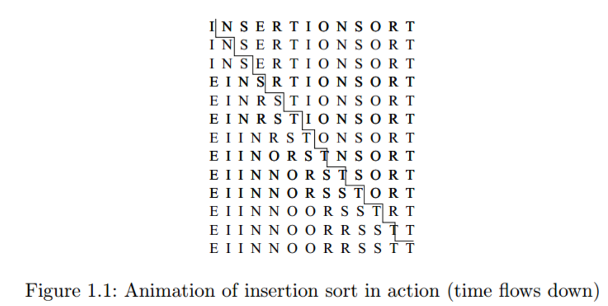

# 算法设计导论

什么是算法？算法是完成特定任务的过程。算法是任何合理的计算机程序背后的想法。
有趣的是，一个算法必须解决一个普遍的、明确的问题。算法问题是通过描述它必须处理的一整套实例以及在这些实例之一上运行后的输出来指定的。问题和问题实例之间的这种区别是根本性的。例如，称为排序的算法问题定义如下:

***Problem：*** 排序

***Input：*** $a_1,...,a_n$
***Output：*** 输入序列的排列(重新排序)，使得 $a'_1 \leq a'_2 \leq ... \leq a'_n$

排序的一个实例可能是一个名称数组，如 ***{Mike, Bob, Sally,  Jill, Jan}***，或者是一个数字列表，如 ***{154、245、568、324、654、324}***。确定你在处理一个普遍的问题是你解决问题的第一步。
算法是获取任何可能的输入实例并将其转换为所需输出的过程。解决排序问题有很多不同的算法。例如，插入排序是一种排序方法，从单个元素开始(从而形成一个普通的排序列表)，然后逐渐插入剩余的元素，使列表保持排序。该算法用C语言实现，描述如下:



```C
insertion_sort(item s[], int n)
{
    int i,j; /* counters */
    for (i=1; i<n; i++) {
        j=i;
        while ((j>0) && (s[j] < s[j-1])) {
            swap(&s[j],&s[j-1]);
            j = j-1;
        }
    }
}
```

图1.1给出了这个算法在特定实例上的逻辑流程动画(单词“INSERTIONSORT”中的字母)

注意这个算法的一般性。它在名字上的排序和在数字上的排序表现一样好，给定适当的比较操作(<)来测试两个键中的哪一个应该按排序顺序首先出现。根据我们对排序问题的定义，可以很容易地验证该算法对每个可能的输入实例进行了正确排序。

一个好的算法有三个可取的特性。我们寻求正确、高效、易于实现的算法。这些目标可能无法同时实现。在工业环境中，无论是否存在更好的算法，任何似乎给出足够好的答案而不会降低应用速度的程序通常都是可以接受的。寻找最佳答案或实现最大效率的问题通常只有在严重的绩效或法律 ***(legal)*** 问题之后才会出现在生产环境中。

在这一章中，我们将集中讨论算法的正确性问题，并将效率问题的讨论推迟到第二章。一个给定的算法能否正确的解决给定的问题是很明显的。正确的算法通常带有正确性的证明，这是一种解释，为什么我们知道算法必须把问题的每个实例都得到期望的结果。然而，在我们进一步说明为什么“显而易见”永远不足以证明正确性，而且这通常是完全错误的。