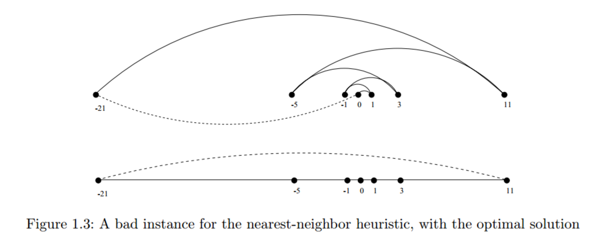
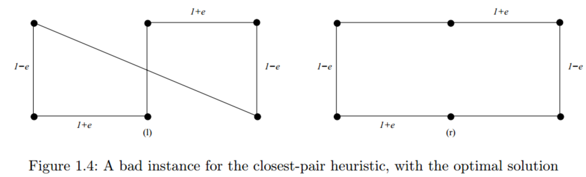

# 1.1旅行商问题

让我们考虑一个在制造、运输和测试应用中经常出现的问题。假设给我们一个装备有工具的机器人手臂，比如一个烙铁。在制造电路板时，所有的芯片和其他元件都必须固定在基板上。更具体地说，每个芯片都有一组必须焊接到板上的触点(或导线)。为了给机器人手臂编程来完成这项工作，我们必须首先构造接触点的顺序，以便机器人访问(和焊接)第一个接触点，然后访问第二个接触点，第三个接触点，等等，直到完成这项工作。机器人手臂然后回到第一个接触点，为下一块板做准备，从而将刀具轨迹变成一个封闭的循环。

机器人是昂贵的设备，所以我们希望这次环绕能最大限度地减少组装电路板的时间。一个合理的假设是，机械臂以固定的速度运动，因此两点之间行进的时间与它们的距离成正比。简而言之，我们必须解决以下算法问题：

***Problem：*** 机器人循环工作优化

***Input：*** 平面内n个点的集合S

***Output：*** 访问集合S中每个点的最短循环是什么？

你的任务是给机器人手臂编程。马上停下来，想出一个算法来解决这个问题。我很乐意等到你找到一个。

可能会想到几种算法来解决这个问题。也许最流行的想法是最近邻算法 ***(Nearest-neighbor Heuristic)***。从某个点p0开始，我们首先走到它最近的邻居p1。从p1开始，我们走到它最近的未被访问的邻居，因此只排除p0作为候选。我们现在重复这个过程，直到我们用完未访问的点，然后我们返回p0，结束旅程。用伪代码编写的最近邻算法如下所示：

```c
NearestNeighbor(P)
    Pick and visit an initial point p0 from P
    p = p0
    i = 0
    While there are still unvisited points
        i = i + 1
        Select pi to be the closest unvisited point to pi−1
        Visit pi
Return to p0 from pn−1
```

这个算法有很多值得推荐的地方。理解和实现都很简单。在我们参观遥远的景点之前参观附近的景点是有意义的，这样可以减少总的旅行时间。该算法在图1.2中的例子中运行良好。最近邻规则相当有效，因为它最多查看每对点(pi，pj)两次：一次是在将pi添加到教程中时，另一次是在添加pj时。与所有这些积极因素相比，只有一个问题。这个算法完全错了。

错了？怎么会错呢？算法总是会找到一个路径，但不一定会找到最短的可能路径。它甚至不一定接近。考虑图1.3中的一组点，所有这些点都沿着一条线隔开。这些数字描述了每个点位于标记为“0”的点的左侧或右侧的距离。当我们从点“0”开始，重复走到最近的未被访问的邻居时，我们可能会在“0”上不断地从左向右向左向右跳跃，因为算法没有提供如何断开联系的建议。对于这些点来说，一个更好的(实际上是最佳的)路径从最左边的点开始，当我们在最右边的点返回之前向右走的时候，访问每个点。



现在试着想象你的老板看着你的机器人手臂在组装如此简单的板子时左右摇摆的演示时的喜悦。

“但是等等，”你可能会说。“问题在于从‘0’点开始。相反，我们为什么不从最左边的点作为初始点p0开始最近邻规则呢？通过这样做，我们将在这个实例上找到最优解。"

这是100%正确的，至少在我们把例子旋转90度之前是这样。现在所有的点都在最左边。如果点“0”稍微向左移动，它将被选作起点。现在机器人手臂将上下上下跳动，而不是左右左右，但行进时间将和以前一样糟糕。不管你如何选择第一个点，最近邻规则在某些点集上注定是不正确的。

也许我们需要的是一种不同的方法。总是走到最近的点太有限制性了，因为它似乎会让我们做出不想做的动作。一个不同的想法可能是重复连接最近的一对端点，它们的连接不会产生问题，例如周期的过早终止。每个顶点都从自己的单个顶点链开始。在把所有的东西合并在一起后，我们将得到一个包含所有点的单一链。连接最后两个端点给了我们一个循环。在这个最邻近点对启发式算法 ***(closest-pair heuristic)*** 执行过程中的任何一步，我们都会有一组单个顶点和顶点不相交链可供合并。在伪代码中：

```c
ClosestPair(P)
    Let n be the number of points in set P.
    For i = 1 to n − 1 do
        d = ∞
        For each pair of endpoints (s, t) from distinct vertex chains
            if dist(s, t) ≤ d then sm = s, tm = t, and d = dist(s, t)
        Connect (sm,tm) by an edge
    Connect the two endpoints by an edge
```

在图1.3的例子中，这个最近对规则做了正确的事情。它首先将“0”连接到它的近邻点1和1。随后，下一个最接近的对将左右交替，一次一个链接地增长中心路径。最邻近点对启发式算法比前一个稍微复杂一些，效率也低一些，但至少在这个例子中给出了正确的答案。

但并非所有例子都是如此。考虑一下这个算法对图1.4(l)中的点集做了什么。它由两排等间距的点组成，各排之间的距离(距离1 - e)略小于每排中相邻点之间的距离(距离1 + e)。因此，最接近的点对延伸穿过间隙，而不是围绕边界。在我们把这些点配对后，最接近的剩余的线对将围绕边界交替连接这些线对。最邻近点对的总路径长度为 $ 3(1 - e) + 2(1 + e) + \sqrt{ (1-e)^2 + (2+2e)^2}$
与图1.4(r)所示的旅行相比，当e ≈ 0时，我们旅行的距离比需要的距离多20%。存在惩罚比这严重得多的例子子。



因此，第二个算法也是错误的。这些算法哪一个性能更好？光看是看不出来的。很明显，这两种启发式方法在看起来非常平常 ***(innocent-looking)*** 的输入上可能会导致非常糟糕的结果.

在这一点上，你可能想知道我们问题的正确算法是什么样的。嗯，我们可以尝试枚举点集的所有可能的排序，然后选择最小化总长度的排序：

```c
OptimalTSP(P)
    d = ∞
    For each of the n! permutations Pi of point set P
        If (cost(Pi) ≤ d) then d = cost(Pi) and Pmin = Pi
    Return Pmin
```

由于考虑了所有可能的顺序，我们保证以最短的行程结束。这个算法是正确的，因为我们选择了所有可能性中最好的。但也极其缓慢。世界上最快的计算机不可能列举出所有的20！=一天内20点的2，432，902，008，176，640，000次订单。对于真正的电路板，n≈1000的地方，拉几把倒吧。世界上所有全职工作的计算机都不会在宇宙末日之前完成这个问题，到那时这个问题可能就没有意义了。

寻找一种有效的算法来解决这个问题，称为旅行推销员（TSP）问题，将带我们通过这本书的大部分。如果你想知道故事的结局，请查阅第16.4节(第533页)中旅行推销员问题的目录条目。